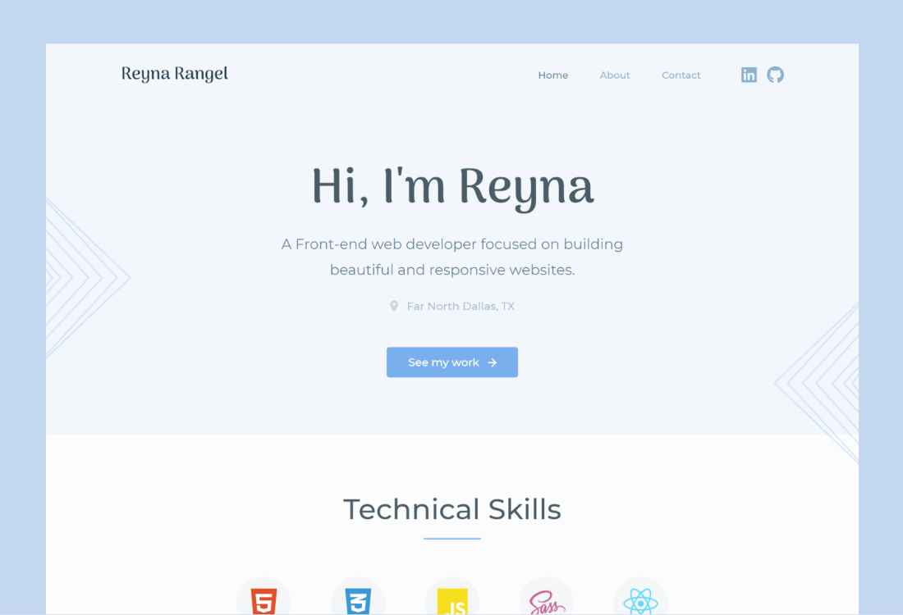

# Personal Portfolio

This project was created as a portfolio to showcase projects I've worked on, share some information about me, and provide ways to reach me. It was built with React and Sass. 

 

## My process

### Built with

- [Adobe XD](https://www.adobe.com/products/xd.html) - UX design tool
- [React](https://reactjs.org/) - JS library
  - React Router
  - Formspree API
  - react-hook-form
  - react-html-parser
  - Framer Motion
  - react-intersection-observer 
  - react-scroll 
- [Sass](https://sass-lang.com/) - CSS pre-processor
  - partials 
  - variables 
  - Flexbox 
  - CSS Grid 
- Mobile-first workflow

### Steps I followed 

1. decide on content to host on website 
2. create/write this content 
3. decide on the websites general architecture 
4. sketch low-fidelity wireframes 
5. design high-fidelity prototypes with Adobe XD 
6. decide what technologies to build with 
7. develop the website 

### What I learned/challenges 

This project provided me with great insight into the full website development process. The process was challenging since it involved many practices I had no experience with, such as content writing and layout design. I also faced many development issues as I tried to integrate technologies I hadn’t worked with before. This was also a greater scale project than I was used to working on, so keeping an organized file structure was difficult. However, these difficulties greatly added to my web development learning experience. 
